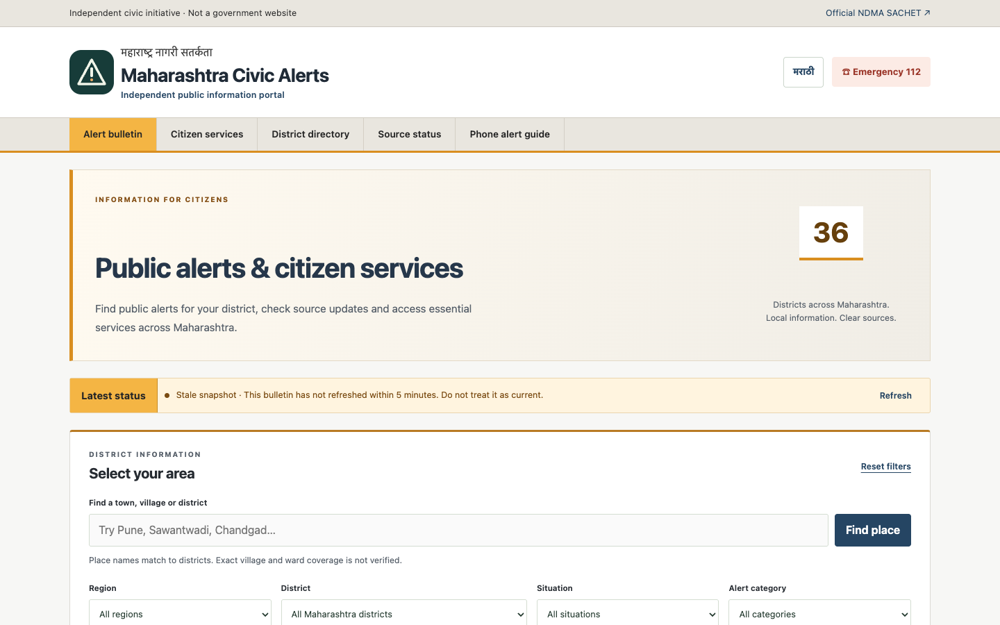

# Maharashtra Civic Alerts

Independent English/Marathi hub for official Maharashtra public alerts, district search and service directories.

**This is not a government website or an emergency dispatch service.** In immediate danger call **112**. Zero relayed alerts does not mean an area is safe.

**Use it live:** [maharashtra-sachet.mangeshraut712.workers.dev](https://maharashtra-sachet.mangeshraut712.workers.dev)



## How to use (in short)

1. Open the site. Read the independent-project banner and **Latest status**.
2. Search a place (Pune, Sawantwadi, Navi Mumbai) or pick a district. Place names map to a **district**, not a verified village/ward boundary.
3. If two districts appear (Navi Mumbai → Raigad and Thane), choose the one that matches your area.
4. Read **Source health** before treating an empty bulletin as “all clear”.
5. Use **Citizen services** for official portals. Directory links are not live incident feeds.
6. Switch to **मराठी** when needed. Optional notifications only work while the page is open.

Full walkthrough and current live numbers: [How to use](docs/HOW-TO.md) · [Current snapshot](docs/STATUS.md)

## Current live snapshot

Captured **5 Sept 2026, 16:39 IST** from production. The latest stored generation was `2026-09-05T10:33:41.986Z` (16:03:41 IST), so the health endpoint correctly reported it as stale. Feeds and health can change after this snapshot.

| Check | Result |
| --- | --- |
| Production health | HTTP 503, `status: stale`, last generation `2026-09-05T10:33:41.986Z` |
| Active alerts | **0** (expired CAP records are excluded) |
| SACHET | Stale, **10** last-known retained records |
| IMD / INCOIS | Stale, **0** last-known records |
| CWC / CPCB | Explicitly **disabled** (not connected) |
| Districts | All **36** listed; none had a live alert in this snapshot |
| Place search | Navi Mumbai → Raigad + Thane; Sawantwadi → Sindhudurg; Marunji is in source as Pune and needs a production deploy to appear on the live site |

Staging was **stale** at the same time (`generatedAt: 2026-09-05T10:23:59.254Z`). Treat staging as a deploy target, not a second live bulletin.

## Run locally

Node.js 24 LTS (see `.node-version`) and npm:

```sh
npm ci
npm start
# http://127.0.0.1:8787
```

```sh
npm test                 # offline tests; live network checks skipped
npm run typecheck
npm run test:e2e         # after: npx playwright install --no-shell chromium
```

Deploy, rollback and secrets: [operations](docs/OPERATIONS.md). API: [docs/API.md](docs/API.md). All docs: [docs/README.md](docs/README.md).

## What this project does not do

- Originate government alerts, cell broadcasts or US Wireless Emergency Alerts.
- Guarantee complete village, ward or municipal coverage.
- Connect statewide live power, water, traffic or AQI feeds (those are official directories unless a source is enabled).
- Deliver background Web Push after you close the tab.

The software is MIT licensed. Government content stays attributed to its source.
