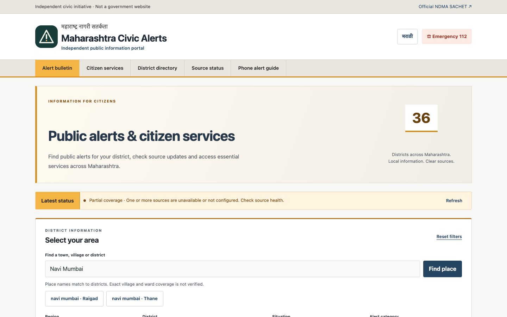
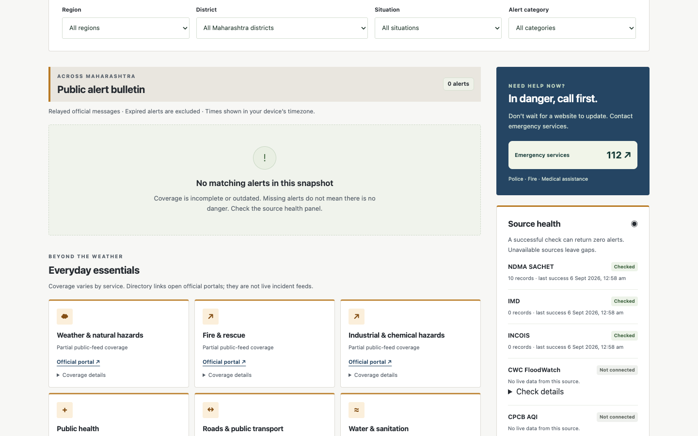
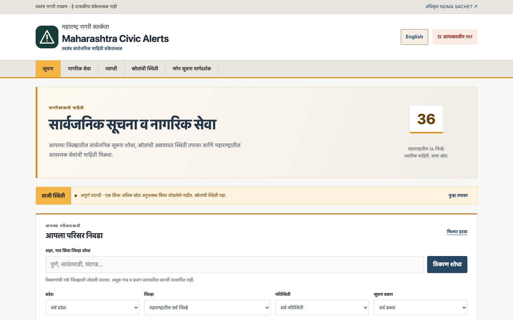
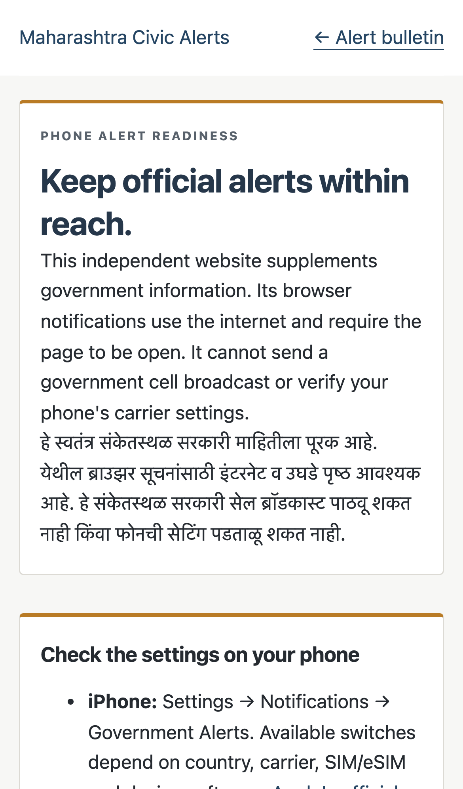
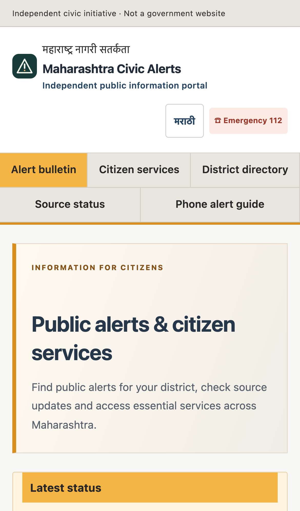

# How to use Maharashtra Civic Alerts

Live site: https://maharashtra-sachet.mangeshraut712.workers.dev

This is an independent relay of public official feeds. It does not dispatch help. Call **112** in danger.

## On the website

1. **Confirm identity.** The masthead says it is not a government website and links to [NDMA SACHET](https://sachet.ndma.gov.in/).
2. **Read Latest status.** Partial coverage is expected while CWC and CPCB stay disconnected. A stale or unavailable status means the remaining feeds have not refreshed recently. Neither state is an all-clear.
3. **Find your area.** Type a town or district, then **Find place**. Results are district aliases.

   

4. **Pick one district** when a name spans two (Navi Mumbai). Then read the bulletin for that district.
5. **Check Source health** before sharing “there are no alerts”. A healthy source can still have zero active messages.

   

6. **Open Citizen services** for weather, fire, health, transport, water, power and other official portals. Coverage details say whether a live feed is connected.
7. **Switch language** with मराठी / English. District names stay searchable in both.

   

8. **Phone alert guide** explains device government-alert settings. This site cannot send a carrier cell broadcast.

   

## On a phone

The same site works in a mobile browser. Notifications, if enabled, only run while the tab is open.



## As a developer

```sh
npm ci
npm start                 # live public sources, http://127.0.0.1:8787
npm run demo              # labelled fixture bulletin (2 test alerts), http://127.0.0.1:8799
npm run verify:realtime   # observe two advancing production generations, read-only
npm test
npx wrangler d1 migrations apply maharashtra-sachet-local --local
npm run dev:worker
```

Useful reads: [API](API.md), [operations](OPERATIONS.md), [coverage](COVERAGE.md).

## Honest limits while you use it

- Place search is not a complete village directory. Marunji resolves on production as a Pune district hint, not a verified village, ward or municipal boundary.
- Empty bulletin + healthy SACHET means no **active public Actual** CAP items in this snapshot, not “Maharashtra is safe”.
- Expired, cancelled, private-scope and Test messages are kept out of the public list on purpose.
